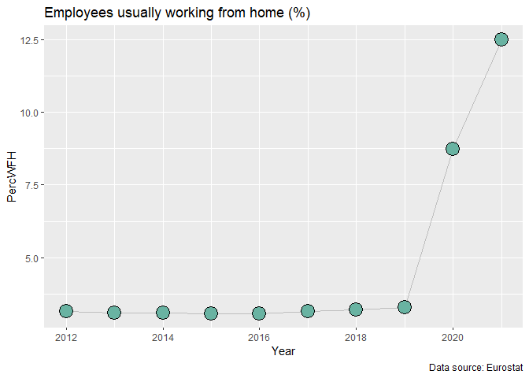

## Working from home in EU

A picture of the diffusion of the working from home modality during and
‘after’ the pandemic in EU countries.

A clear huge revolution in the work organisation, which can not be
dismissed as a temporary measure to overcome the Covid-19 pandemic.

A simple measure gives count of the phenomenon. The average percent of
workers (employees) that usually work from home in the following three
years: 2019, 3.28%, 2020, 8.72%, 2021, 12.51%.

Moreover, as we can appreciate, the dynamic of the percentage of
employees usually working from home (PercWFH) was rather flat in the
past thirty years, with a peak in the last two.

Since the number of employees in EU countries is around 155 millions,
the positive delta percent of 10 points registered from 2019 to 2021 for
those employees ‘usually working from home’ involved around 15 millions
employees.

For further insights see
<https://ec.europa.eu/eurostat/web/products-eurostat-news/-/ddn-20210923-1>.
